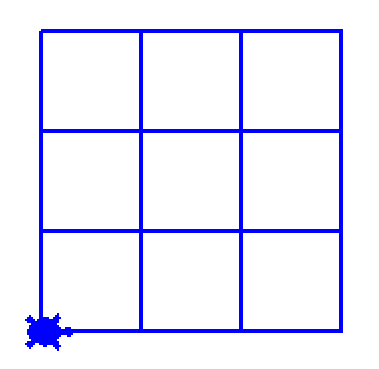
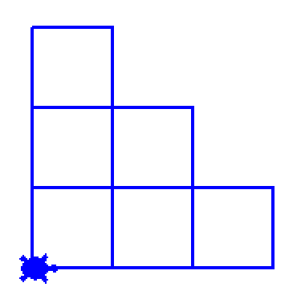

# Working with the Turtle

## Exercises

Using **Visual Studio Code**, create a file called **turtleIntro.py** and complete the following challenges.

## 04-0:  Polygon
Create a function called **polygon(s,n)** that will draw any polygon with **n** sides, where the side length is **s**.

So,

polygon(50,5)

should draw a ***pentagon*** with side lengths of 50 pixels.

**Note:**  To figure out how this function works, create two other functions:  **triangle(s)** and **pentagon(s)**, that will draw a triangle and pentagon with side lengths **s**.  Use what you learn by creating these functions to create the **polygon(s,n)** function.  There is a connection between the **number of sides** in the polygon and the **turning angle** of the turtle.  You must use this equation/relation to within your **polygon(s,n)** function.

## 04-1:  Row

(i) Use your **square(s)** function to define a function (using the keyword def) called **row(s, n)** that draws a row of n squares of side length s.  (ii) Use your **row(s, n)** function to draw a row of 3 squares of side length 50.


## 04-2:  Grid 

(i) Use your **row(s, n)** function to define a function called **grid(s, n)** that draws a grid of n x n squares of side length s.  (ii) Use your **grid(s, n)** function to draw a 3 x 3 grid of squares of side length 50..



### Important Note:

The purpose of these exercises is to use functions that perform one task to help you perform another task.

For example, once you have a function called **square(s)**, it can be used to draw a ***row of 3 squares*** each of ***side length 50*** as follows

```python3
for i in range(3):
    square(50)
    turtle.forward(50)
```

You need to create a function called **row(s,n)** that will draw a ***row of n squares*** each of ***side length s***.  The code inside the function will look similar to the code above.

Now you can use your **row(s,n)** function to create a ***grid of n rows*** .  For example,

```python3
for i in range(3):
    row(50,3)
    turtle.backward(150)
    turtle.right(90)
    turtle.forward(50)
    turtle.left(90)
```

will draw a ***3 x 3 grid of squares*** each with ***side length 50*** .

You need to create a function called **grid(s,n)** that will draw a ***grid of n x n squares*** each of ***side length s*** .

## 04-3:  Stairs

(i) Use your **row(s, n)** function to define a function called **stairs(s, n)** that draws a set of stairs made of squares of side length s with a base n squares wide.  (ii) Use your **stairs(s, n)** function to draw a set of stairs made of squares of side length 50 with a base 4 squares wide.


